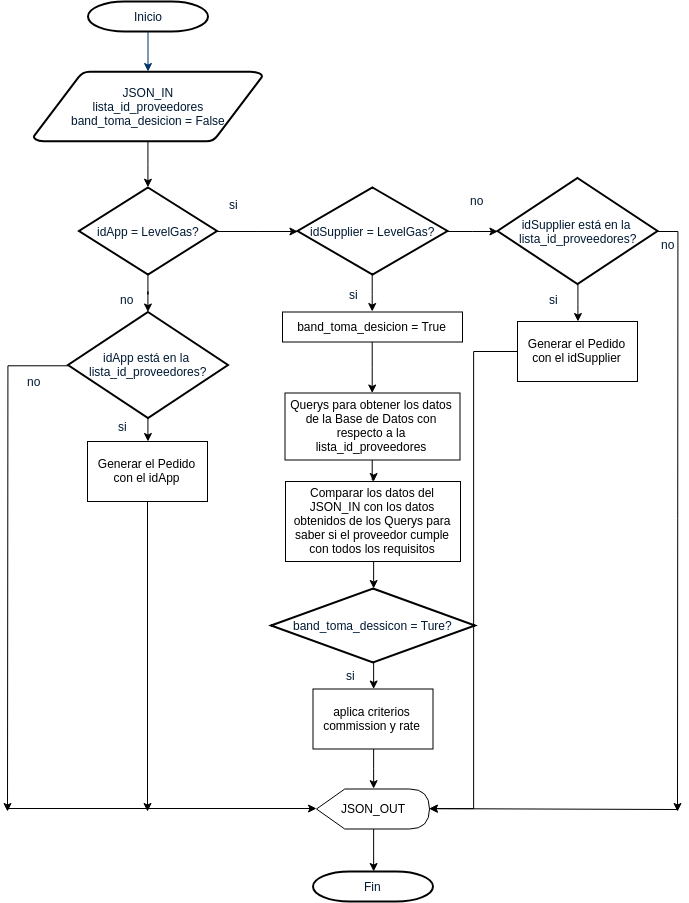

# Slice-API lvl Gas Edisson Effect
## Introduccion 
  
  El Api fue desarrollado bajo python(python 3) mediante el microframework FLASK entre otros modulos.
  
  Basicamente el proyecto tuvo 2 bifurcaciones especificas, la seleccion del proveedor y todo lo relativo a la gelocalizacion.
  
  En un principio se plantearon e implementaron tecnicas de inteligencia artificial para el desarrollo de la parte de la seleccion del proveedor para realizar la compra, pero esto resulto en ser algo bastante sobrado 
  para lo que se requeria, ademas de que su implementacion resultaba poco eficiente para cuando fuera necesario actulizar la base de datos.

  Para la parte de la validacion de la geolocalizacion tomo un enfoque un tanto mas complejo y laborioso debido a que tambien se bifurco en 2 objetivos en particular:
  1. Determinar las areas de servicio de los proveedores.
  2. Validar que el usuario/tanque de gas estuviese dentro de las areas de servicio de los proveedores.
 
  Para esto se decidio crear un portal en el que el proveedor pudiera dar de alta su area de servicio y la validacion se realiza dentro la peticion en el servidor.

## Estructura de Directorios

```javascript
Slice-API-LlvGas/
├── modulos
│   
├
├── static
│   ├── css
│   ├── geo_data
│   └── js
└── templates
```

  
## Toma de Desición
    
Como se menciona en la introducción inicialmente se empezó a implementar esta parte con algoritmos de Inteligencia Artificial, pero esto requería, generar un script por cada proveedor, lo cual era demasiado tedioso y esto a la larga corria el riesgo de generar errores al tener que estar agregando las modificaciones.

Haciendo un análisis más a fondo se llegó a la conclusión de que la Toma de Desición se podría realizar con ciclos anidados y condisionales. Resultando éste método muy eficiente para los Requerimientos iniciales del Proyecto.
    
El Siguiente Diagrama muestra el Flujo del Algoritmo para la Toma de Desición

### Diagrama Toma de desición



## Requisitos de Instalación

  Los paquetes para el correcto funcionamiento de la API son:
  1. Python3
  2. Administrador de paquetes para Python3 (pip)
  3. Entorno Virtual (virtualenv)
  4. Framework Flask
  

### Instalar virtualenv
 sudo apt-get install python-virtualenv virtualenv
### Crear un entorno virtual de Python con virtualenv
 virtualenv env --python=python3
### Activar un entorno virtual de Python con virtualenv
 source env/bin/activate
### Desactivar un entorno virtual de Python con virtualenv
 deactivate
 
### Instalar paquetes para el Proyecto

#### Para usar la Base de Datos, Forms en  Flask, Bootstrap y Geopandas
 python3 -m pip install flask flask-wtf flask-mysql geopy pandas flask-bootstrap
 
 python3 -m pip install geopandas
